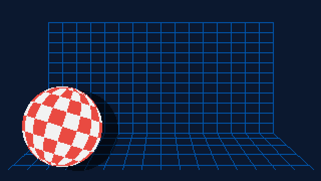
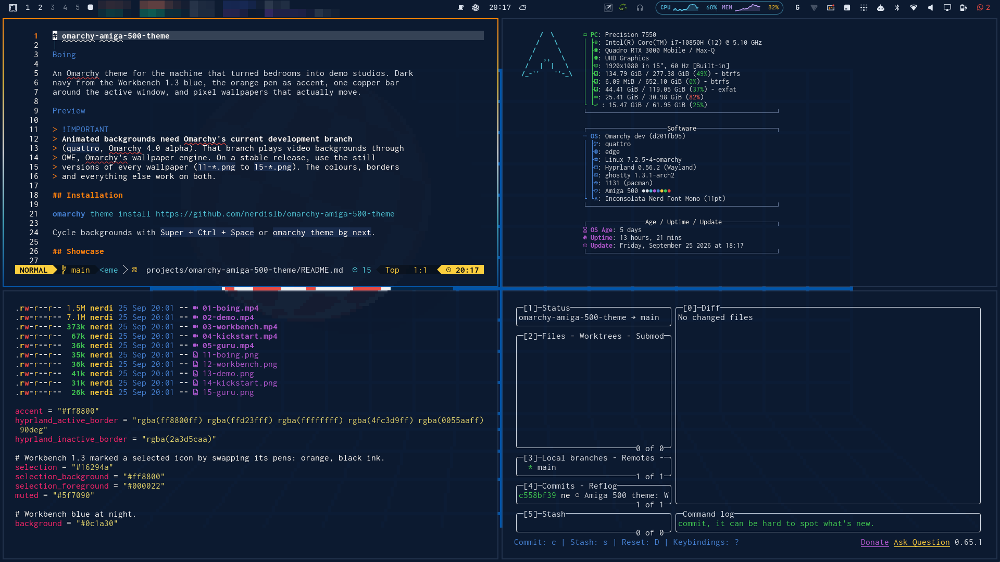
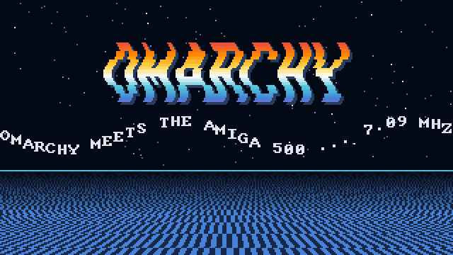
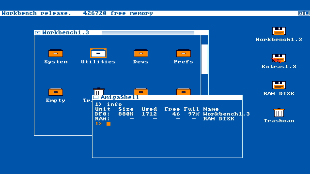
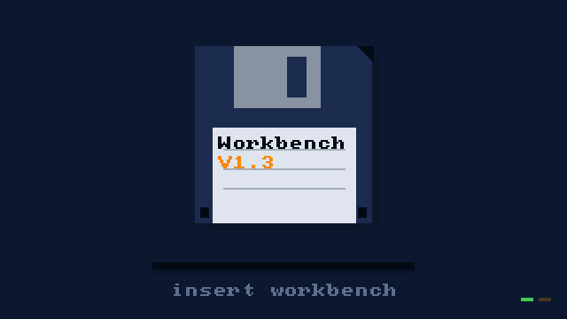
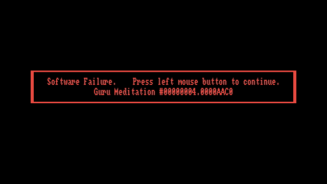
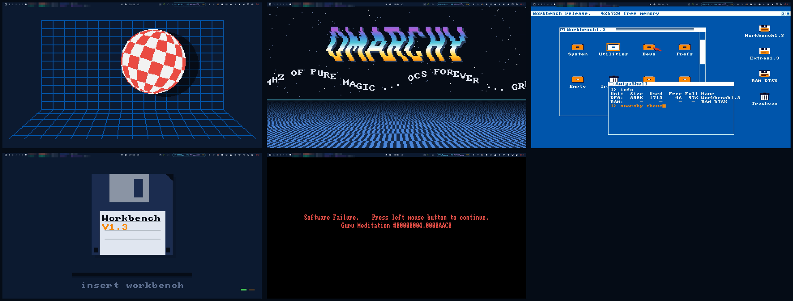

# omarchy-amiga-500-theme



An Omarchy theme for the machine that turned bedrooms into demo studios. Dark
navy from the Workbench 1.3 blue, the orange pen as accent, one copper bar
around the active window, and pixel wallpapers that actually move.



*A real screenshot: Neovim, fastfetch, lazygit and Ghostty with the Boing
background behind translucent terminals. Private bar widgets are pixelated.*

> [!IMPORTANT]
> **Animated backgrounds need Omarchy's current development branch**
> (`quattro`, Omarchy 4.0 alpha). That branch plays video backgrounds through
> OWE, Omarchy's wallpaper engine. On a stable release, use the still
> versions of every wallpaper (`11-*.png` to `15-*.png`). The colours, borders
> and everything else work on both.

## Installation

```bash
omarchy theme install https://github.com/nerdislb/omarchy-amiga-500-theme
```

Cycle backgrounds with `Super + Ctrl + Space` or `omarchy theme bg next`.

## Videos

- [assets/desktop.mp4](assets/desktop.mp4): an 18-second screen recording of a
  real desktop. Boing bounces on an empty workspace, then four windows tile
  over it.
- [assets/showcase.mp4](assets/showcase.mp4): a 47-second run through every
  animated background.

## Animated backgrounds

| | |
|---|---|
|  **Boing.** The 1984 demo that sold the machine: a checkered ball bouncing in front of a grid, spinning with its travel. |  **Demo.** Three-layer starfield, a wobbling copper-cycled logo, a sine scroller and a checkerboard floor rushing at you. |
|  **Workbench 1.3.** The pointer wanders, the AmigaShell types `omarchy theme set amiga-500`, the cursor blinks. |  **Kickstart.** The disk goes into the drive, the drive light flickers, `loading...`, and out it comes again. |
|  **Guru Meditation.** The red frame blinks, exactly as unhelpfully as it did in 1987. | |

Every loop is seamless and silent. The video files carry no audio track,
because OWE would play it.

### Why the videos are 1920x1080

OWE scales video with a bilinear filter, which would smear pixel art. So every
frame is drawn on a real Amiga-sized buffer (320x180 lores or 640x360 hires)
and scaled up by an exact integer with nearest neighbour before encoding. On a
1080p display every Amiga pixel is a crisp 6x6 or 3x3 block. On a 1440p or 4K
display OWE scales the video once more and the edges soften slightly; the still
PNGs are 3840x2160 and stay sharp everywhere.

A moving background costs more power than a still one. OWE pauses playback
while a fullscreen window covers it. For battery options see
`/usr/share/doc/owe/config.toml.example`.

## On a real desktop



Screenshots of each animated background on an empty workspace, taken on a
1080p laptop. The Guru frame happened to be in its dark phase.

The same five scenes also ship as 3840x2160 PNGs (`11-*.png` to `15-*.png`),
for stable Omarchy releases or for anyone who prefers their desktop to hold
still.

## Where the colours come from

Workbench 1.3 drew its whole interface with four pens. They are the spine of
the theme:

| Pen                 | Role in the theme                                       |
|---------------------|---------------------------------------------------------|
| Blue `#0055AA`      | `background`, darkened to `#0c1a30` for long sessions; the bottom of the copper bar |
| White `#FFFFFF`     | `foreground`, softened to `#dfe6f0`                     |
| Black `#000022`     | `selection_foreground`, the ink on a selected icon      |
| Orange `#FF8800`    | `accent`, `selection_background`, top of the copper bar |

The chromatic slots come from the rest of the machine:

| Slot      | Source                                   |
|-----------|------------------------------------------|
| `red`     | the Guru Meditation frame                |
| `green`   | the power LED                            |
| `blue`    | Workbench blue, lifted until it reads on navy |
| `yellow`  | the copper bar                           |
| `cyan`    | the copper bar                           |
| `magenta` | the Boing demo's grid, before it went blue here |

Every normal ANSI slot holds at least 4.6:1 contrast against the background,
so coloured terminal output stays readable.

The active window border is a single copper bar: orange, yellow, white, cyan,
Workbench blue, top to bottom. Selection works the way Workbench 1.3 selected
an icon, by swapping pens: orange ground, black ink.

## Credits

- Inspired by [omarchy-c64-theme](https://github.com/AlexZeitler/omarchy-c64-theme)
  by Alexander Zeitler, which showed how a theme can come from a machine.
- The lettering inside the wallpapers is rendered with the Topaz bitmap font
  from [rewtnull/amigafonts](https://github.com/rewtnull/amigafonts)
  (GPL-FE). No font files are shipped.
- Amiga, Workbench, Kickstart and the Boing Ball are trademarks of their
  respective owners. This is an unofficial fan theme.

## License

MIT
